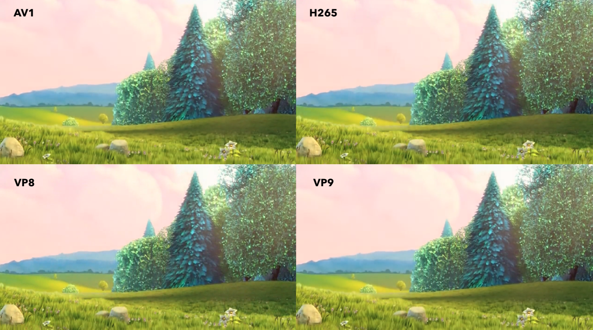
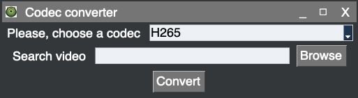

# Description
Here you can find the solution for S3 exercises from Audio and Video 
encoding systems.

## Exercise 1
## Exercise 1.1
In exercise_1.py, we were asked to convert 4 videos to 4 
codecs. The 4 input videos were the same video of BBB.mp4
with the following resolutions:
* 720p
* 480p
* 360x240
* 160x120

The codecs were:
* VP8
* VP9
* h265
* AV1

To make the conversions, we used `ffmpeg`.

## Exercise 1.2
In exercise_1_2.py, we create a mosaic with the 4 codecs keeping the 
same resolution. So, we end up with a video like this.

    

## Exercise 2
In exercise_2.py, we have build a video codec converter
desktop application. It converts any given video to any
of the 4 codecs mentioned above.

    

# Dependencies
## Python dependencies
Please, install the dependencies describe in the `requirements.txt` file.
Please, use `pip` as the package manager to install.

``pip install -r requirements.txt``

## FFMPEG dependencies
To be able to successfully execute these scripts it is necessary
to compile `ffmpeg` with the following libraries:
* `aom`: for AV1 video codec
* `libvorbis`: for VP8 audio codec
* `libvpx`: for VP8 video codec
* `libopus`: for VP9 audio codec
* `libx265`: for H265 video codec

Please, refer to the `ffmpeg` documentation to compile it including these 
libraries.

# Other
THe image used as icon has been downloaded from <a src="https://you.com/proxy?url=https%3A%2F%2Ftse4.mm.bing.net%2Fth%3Fid%3DOIP.fX6G3g6AHCuKeT5SoRfhlgHaHF%26w%3D690%26c%3D7%26pid%3DApi%26p%3D0">here</a>.
